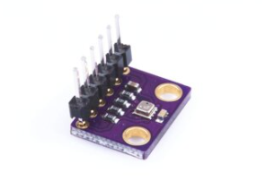
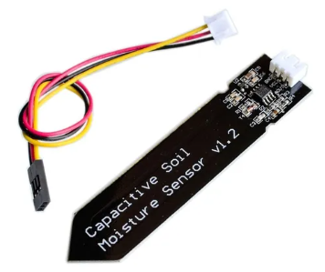

# Plant-GPT (iPlant)

Dispositivo portátil el para monitoreo de plantas 

## Objetivo

Diseñar e implementar un dispositivo portátil de medición de variables físicas relacionadas al cuidado de las plantas, de manejo sencillo y accesible.

El proyecto se alinea con los objetivos 11 y 15 de los Objetivos de Desarrollo Sostenible:

 El dispositivo puede ser una forma de facilitar el cuidado de plantas a personas sin experiencia en esta área, funcionando a modo de guía básica.

## Características Esperadas

+ Tamaño portátil, cercano o similar al de un teléfono celular promedio.

+ Batería autónoma, recargable mediante puerto tipo C.

+ Lectura de (al menos) las siguientes variables: 

    + Temperatura ambiente
    + Temperatura del suelo
    + Humedad del aire
    + Humedad del suelo
    + Acidez del suelo
    + Intensidad lumínica
+ Pantalla monocromática de bajo consumo
+ Botón de lectura de datos o "Hold"
+ Conexión con una aplicación externa para el guardado de registros de lecturas previas
+ Organización de lectura organizada de diferentes plantas

## Sensores
### Temperatura, Presión y Humedad

BME280 es un sensor de temperatura, presión y humedad ambientales, funciona con alimentación de 3.3V y otorga la lectura mediante protocolo I2C o SPI.

### Humedad en Suelo

Es preferible escoger un sensor de humedad en suelo de tipo capacitivo y no resistivo, pues estos últimos se degradan y oxidan con rapidez.

Este sensor, al igual que el de acidez, debe ser enterrado en el suelo de la planta para la lectura, y por ello es conveniente que estos estén conectados al resto del dispositivo mediante un cable.

## Procesamiento

El procesamiento será realizado por una tarjeta de desarrollo ESP32, programada mediante la IDE de Arduino. Se escogió esta tarjeta por su facilidad de incorporación de capacidades Bluetooth o WiFi para la organización de datos en una aplicación externa.

