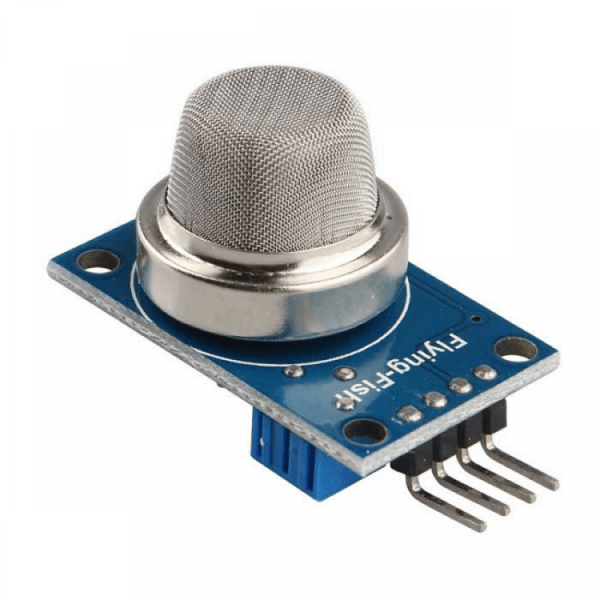

# Plant-GPT (iPlant)

Dispositivo portátil el para monitoreo de plantas 

## Objetivo

Diseñar e implementar un dispositivo portátil de medición de variables físicas relacionadas al cuidado de las plantas, de manejo sencillo y accesible.

El proyecto se alinea con los objetivos 11 y 15 de los Objetivos de Desarrollo Sostenible:

 El dispositivo puede ser una forma de facilitar el cuidado de plantas a personas sin experiencia en esta área, funcionando a modo de guía básica.

## Características Esperadas

+ Tamaño portátil, cercano o similar al de un teléfono celular promedio.

+ Batería autónoma, recargable mediante puerto tipo C.

+ Lectura de las siguientes variables: 

    + Temperatura ambiente
    + Temperatura del suelo
    + Humedad del aire
    + Humedad del suelo
    + Acidez del suelo
    + Intensidad lumínica
+ Pantalla monocromática de bajo consumo
+ Botón de lectura de datos o "Hold"
+ Conexión con una aplicación externa, via Bluetooth o Wi-fi, para el guardado de registros de lecturas previas
+ Acceso a historial de datos para diferentes plantas

## Sensores
### Temperatura, Presión y Humedad

BME280 es un sensor de temperatura, presión y humedad ambientales, funciona con alimentación de 3.3V y otorga la lectura mediante protocolo I2C o SPI.

### Humedad en Suelo

Es preferible escoger un sensor de humedad en suelo de tipo capacitivo y no resistivo, pues estos últimos se degradan y oxidan con rapidez.

Este sensor, al igual que el de acidez, debe ser enterrado en el suelo de la planta para la lectura, y por ello es conveniente que estos estén conectados al resto del dispositivo mediante un cable.

La salida de este es de tipo analógica, capaz de operar a 3.3V y a 5V.

### Intensidad lumínica

El sensor de intensidad lumínica es el TEMT6000, conocido por su simplicidad, bajo coste y precisión media, pero suficiente para la aplicación, pues en términos botánicos no se requiere una alta exactitud, y, de todas maneras, los consejos para cuidado de plantas suelen tener un rango bastante pobre, usando términos como "intensa", "media", "semisombra", etc. 

Aún así se considera necesario, especialmente para comparar la intensidad entre posibles locaciones en el hogar.

### Acidez de Suelo

Lamentablemente los sensores de pH de suelo, incluso los más económicos, se escapan exageradamente del promedio de precio de los demás componentes, por lo que sería una inversión poco provechosa.

### CO2 de Aire

Un sensor de C02 en aire aporta información útil para conocer si el posicionamiento de una planta es poco favorable, en caso de que esta sea demasiado sensible y se esté considerando posicionarla en un lugar poco ideal, como, por ejemplo, una ventana que dé directamente a una calle transitada.

El MQ-135 se caracteriza por su bajo coste y confiabilidad media; de nuevo, en línea con las expectativas del proyecto.
## Pantalla

La visualización de datos se hará por medio de la pantalla LCD monocromática Nokia 5110, este a su vez es operado mediante el controlador PCD8544, el cual opera mediante comunicación SPI.

Cuenta con una pantalla 48x84 con posibilidad de retroiluminación graduable, al tratarse de una pantalla LCD, no requiere ser iluminada cuando hay luz externa, de esta manera se puede realizar la lectura de información fácilmente si se está expuesto al sol con un mínimo consumo de energía.

## Procesamiento
El procesamiento será llevado a cabo por el microcontrolador ATMEGA328P-PU, conocido por su simplicidad y versatilidad. El proyecto no requiere un procesamiento severo, por lo cual se considera suficiente ofreciendo aún un ahorro de espacio considerable en comparación al uso de un Arduino UNO o ESP32 completos.

El módulo cuenta con la siguiente nomenclatura de pines
 

## Alimentación

Para la alimentación se usará una batería de ion de Litio de 3.7V junto a un módulo de carga TP4056, que permite conexión tipo USB-C.

Para estabilizar la tensión se requiere un módulo elevador de tensión a 5V estabes, pues la batería varía su tensión de 4.2V cuando está cargada a 3.4V cuando está cerca de descargarse en su totalidad.

